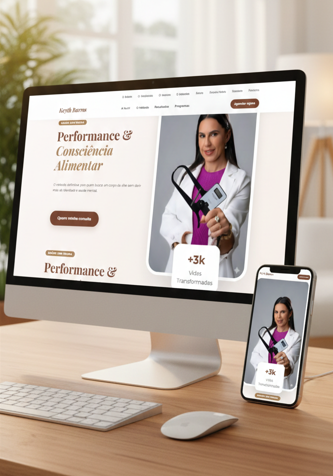

# 🥗 Keyth Barros | Nutrição de Alta Performance

[](LICENSE)
[](https://github.com/seu-usuario)

Uma Landing Page Premium desenvolvida para a nutricionista Keyth Barros, focada em converter visitantes em pacientes através de um design elegante, psicologia das cores (Terracota e Dourado) e uma experiência de usuário (UX) fluida.

---

## ✨ Demonstração

O projeto apresenta uma interface responsiva, com animações de scroll e um sistema de acordeão interativo para a visualização de planos nutricionais.

* **Design:** Paleta de cores sofisticada utilizando Terracota Profundo (`#7a4632`) e Dourado Terroso (`#a67c52`).
* **Interatividade:** Acordeões para planos e botão flutuante para conversão direta via WhatsApp.
* **Performance:** Carregamento otimizado e animações leves.

---

## 🚀 Tecnologias Utilizadas

O projeto foi construído utilizando as melhores práticas de desenvolvimento Web Front-end:

* [HTML5](https://developer.mozilla.org/pt-BR/docs/Web/HTML) - Estrutura semântica.
* [CSS3](https://developer.mozilla.org/pt-BR/docs/Web/CSS) - Layout responsivo com Flexbox, Grid e Variáveis nativas.
* [JavaScript](https://developer.mozilla.org/pt-BR/docs/Web/JavaScript) - Lógica de interatividade (Acordeão e Menu).
* [ScrollReveal](https://scrollrevealjs.org/) - Animações de entrada conforme o scroll.
* [Google Fonts](https://fonts.google.com/) - Tipografia selecionada (Playfair Display & Montserrat).
* [FontAwesome](https://fontawesome.com/) - Ícones de interface.

---

## 🛠️ Funcionalidades

- [x] **Header Fixo:** Navegação intuitiva com efeito de desfoque (*Glassmorphism*).
- [x] **Método SER:** Seção detalhando a metodologia da profissional.
- [x] **Depoimentos:** Prova social estruturada em cards modernos.
- [x] **Tabela de Preços Interativa:** Sistema de acordeão que organiza as informações sem poluir o visual.
- [x] **Mobile First:** Totalmente adaptado para dispositivos móveis com ajustes específicos de usabilidade.
- [x] **Conversão Direta:** Botões estratégicos com links para agendamento via WhatsApp.

---

## 📦 Como rodar o projeto

1. **Clone este repositório:**
   ```bash
   git clone [https://github.com/seu-usuario/seu-repositorio.git](https://github.com/seu-usuario/seu-repositorio.git)

   ## 📱 Demonstração Visual

<p align="center">
  
</p>
